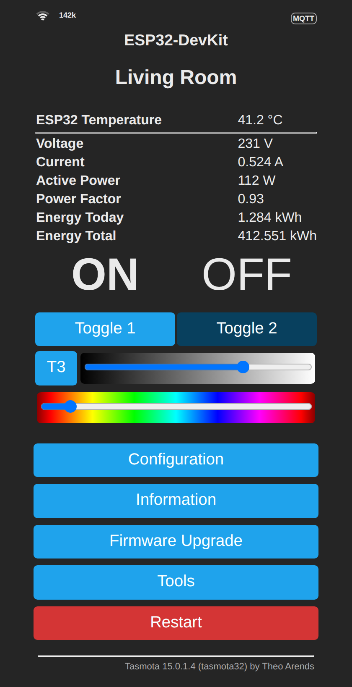
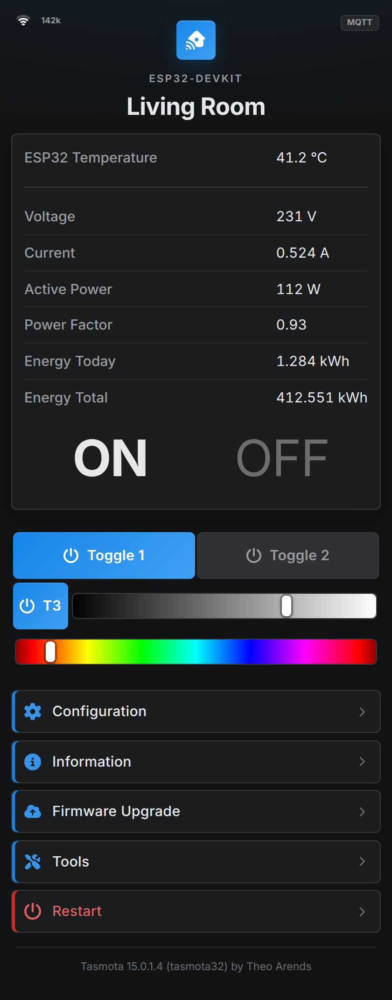
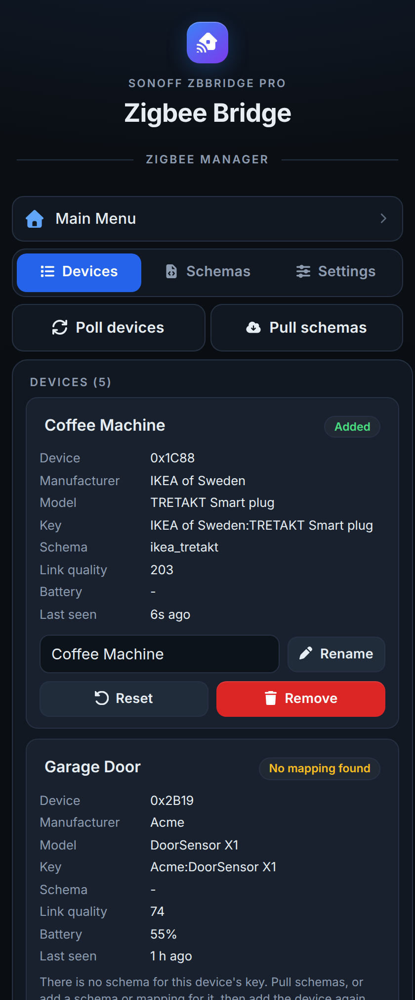
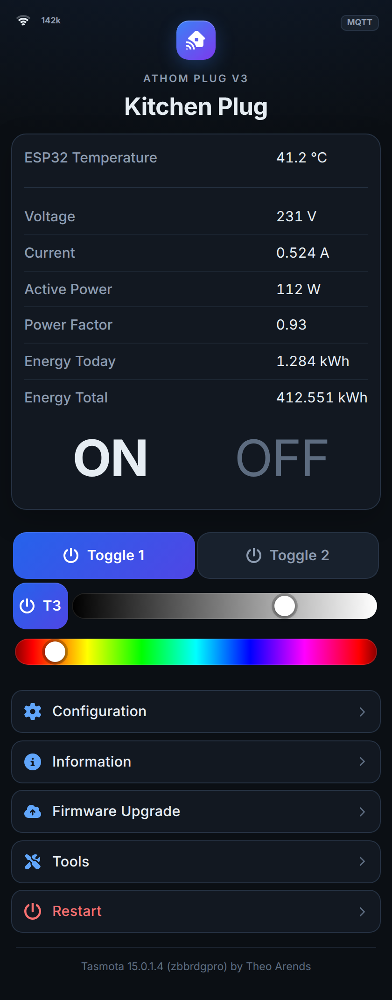
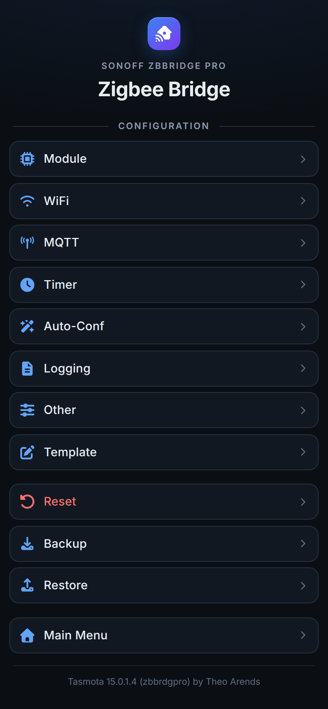
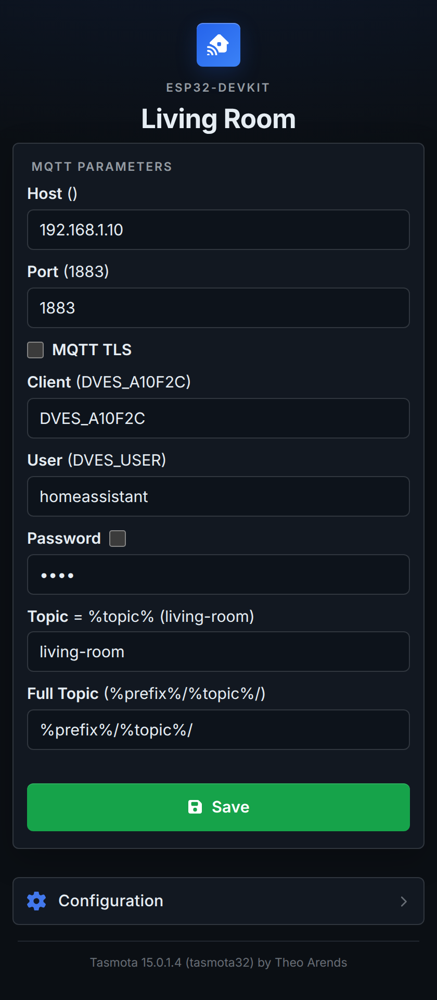
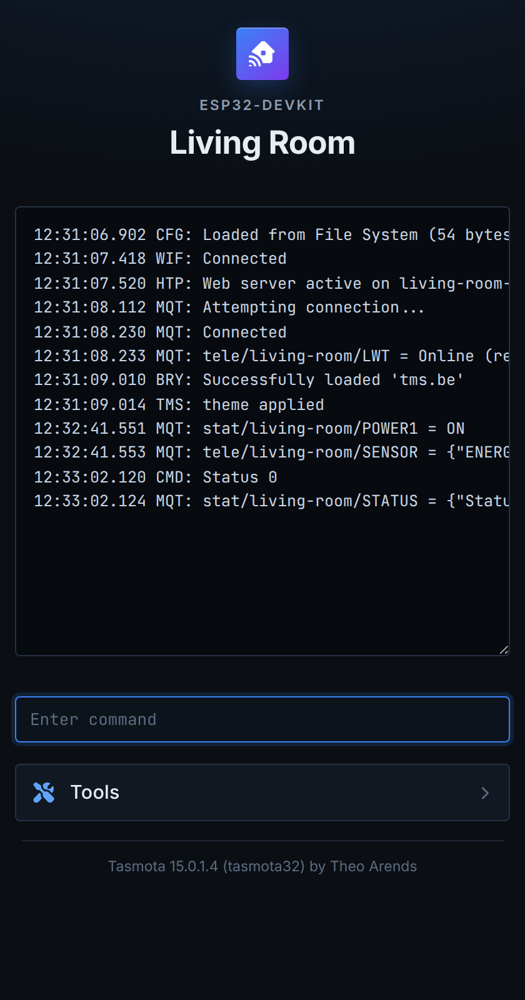

# Zigbee Style

A modern dark theme for the Tasmota web UI, installed as a Tasmota extension (`.tapp`). It restyles every
page, Tasmota's own and the ones added by Berry extensions like
[Zigbee Manager](https://github.com/rmawatson/tasmota-zigbee-manager), without changing the firmware.

<table>
<tr><th>Tasmota</th><th>Zigbee Style</th><th>Zigbee Manager</th></tr>
<tr>
<td valign="top"></td>
<td valign="top"></td>
<td valign="top"></td>
</tr>
</table>

<table>
<tr><th>Relays and lights</th><th>Configuration</th><th>Settings</th><th>Console</th></tr>
<tr>
<td valign="top"></td>
<td valign="top"></td>
<td valign="top"></td>
<td valign="top"></td>
</tr>
</table>

- Pages are a single centred column. The sensors, the information page and every form are cards.
- Menu buttons are rows with a [Font Awesome](https://fontawesome.com) icon and a chevron, Restart and Reset are red.
- The power buttons are coloured when the relay is on and grey when it is off.
- The light sliders have round handles over Tasmota's colour gradients.
- Inputs have a focus ring, the console and the script editors are monospaced and wider.
- The only movement is a short colour fade on hover and focus. Nothing in the sensor area, which Tasmota
  redraws every couple of seconds, is animated.

## Install

To install this extension in Tasmota, paste the url `https://raw.githubusercontent.com/rmawatson/tasmota-zigbee-style/refs/heads/main/extensions/`
into the field at the bottom of the Online Store in `Tools->Extension Manager`, press Enter, and install Zigbee Style
from the list.

Or download [zigbee_style.tapp](https://raw.githubusercontent.com/rmawatson/tasmota-zigbee-style/main/extensions/tapp/zigbee_style.tapp)
and upload it to the `/.extensions` folder of the device with Tools > Manage File system. Start it from
Tools > Extension Manager, or restart the device.

Or in the Berry Scripting console:

```berry
import path
path.mkdir("/.extensions")
tasmota.urlfetch("https://raw.githubusercontent.com/rmawatson/tasmota-zigbee-style/main/extensions/tapp/zigbee_style.tapp", "/.extensions/zigbee_style.tapp")
tasmota.load("/.extensions/zigbee_style.tapp")
```

Reload the page to see the theme. To go back to Tasmota's own style, press Running (which stops it) or
Uninstall in the Extension Manager.

## How it works

Tasmota has no setting for a stylesheet, but it writes the `WebCanvas` setting (the page background) unescaped
into the style in the head of every page:

```
body{background:<WebCanvas> 0 0 / cover no-repeat fixed;}
```

When the extension starts it sets `WebCanvas` to

```
var(--c_bg)}</style><link rel=stylesheet href=/zbs.css><style>:root{--zbs:1
```

which ends that rule and the style, links `/zbs.css`, and opens a style that takes the rest of the line. The
extension adds the `/zbs.css` page, which sends the stylesheet from the tapp. A `WebCanvas` you had set is kept
in front of the link, and put back when the extension stops or is uninstalled.

Tasmota's pages use the same markup in every language, so the stylesheet matches them on their form actions
(`cn` for Configuration, `md` for Module, ...) and on the inline styles Tasmota writes. It also sets Tasmota's
colour variables (`--c_bg`, `--c_btn`, ...), which the inline styles and the pages of other extensions use.

## Notes

- The stylesheet is about 40 KB, 25 KB of it icons. Tasmota sends every page an extension adds with
  `Cache-Control: no-cache, no-store, must-revalidate`, so the browser loads it again with every page.
- `WebCanvas` shares Tasmota's 699 character settings text area with the other text settings. The theme needs
  75 characters, or 92 plus the length of your own `WebCanvas` if you set one. When it does not fit, the log
  shows `ZBS: unable to set WebCanvas, the settings have no room for it. The theme is not shown`.
- Setting `WebCanvas` while the theme runs removes the theme until the extension starts again. It then keeps
  your new value in front of the link, to put back when it stops. The theme draws its own background over it.
- If the tapp is deleted from the file system without stopping it first, the link stays in `WebCanvas`. The
  stylesheet is then not found and the pages look as they did before. `WebCanvas 0` removes it.
- The theme uses Inter if it is installed, otherwise the system font (Segoe UI, San Francisco, Roboto).
- Icons need CSS masks. The cards around the sensors and the wider console need `:has()` (Chrome and Edge 105,
  Safari 15.4, Firefox 121 and later); older browsers show the rest of the theme without them.
- Menu buttons added by other extensions get a cube icon. To give one its own icon, add a rule like
  `form[action=zbman] { --i: icon(circle-nodes) }` to `src/zbs.css`, with the icon in `src/icons`.

## Building

```
python3 scripts/gen_css.py   # builds raw/zigbee_style/zbs.css from src/zbs.css and src/icons
python3 scripts/gen.py       # builds extensions/tapp/zigbee_style.tapp and extensions/extensions.jsonl
```

`src/zbs.css` is the stylesheet, `icon(name)` in it is replaced by `src/icons/name.svg`. The icons are copied
from the `svgs` folder of Font Awesome Free 7.3.1. `scripts/upload.py` uploads a tapp to a device over FTP.

## Credits

Icons: [Font Awesome Free](https://fontawesome.com) 7.3.1 by @fontawesome, licensed under
[CC BY 4.0](https://creativecommons.org/licenses/by/4.0/) (https://fontawesome.com/license/free).

The theme is MIT licensed, see [LICENSE](LICENSE).
