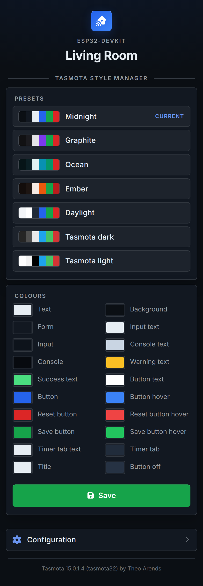
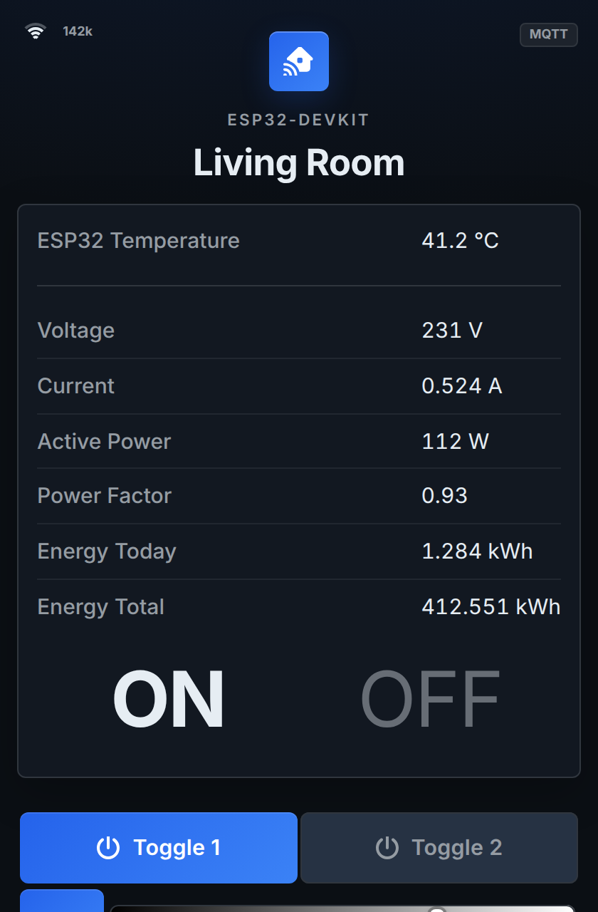
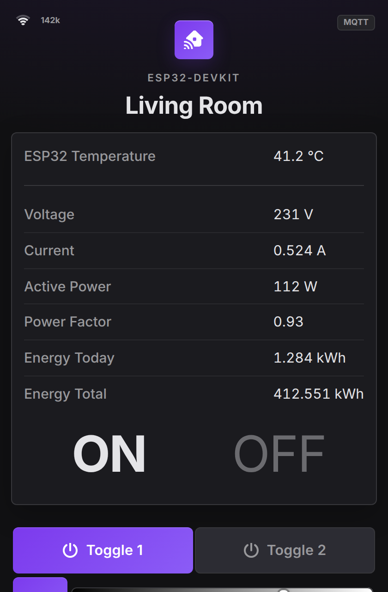
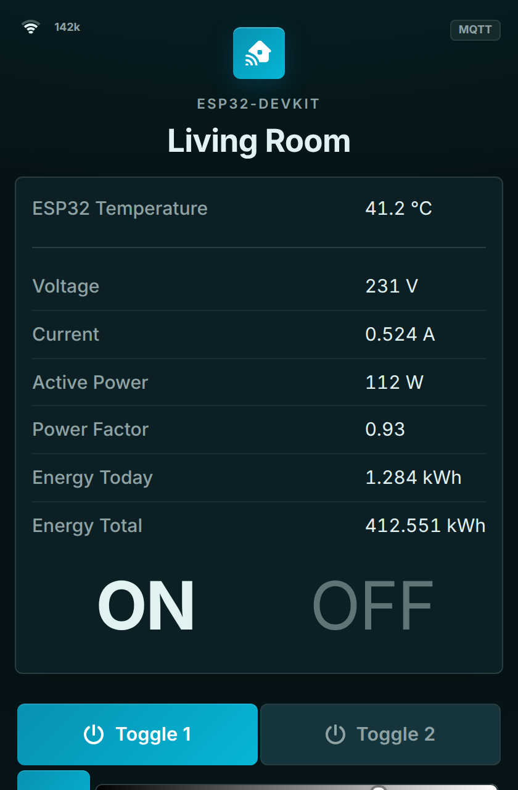
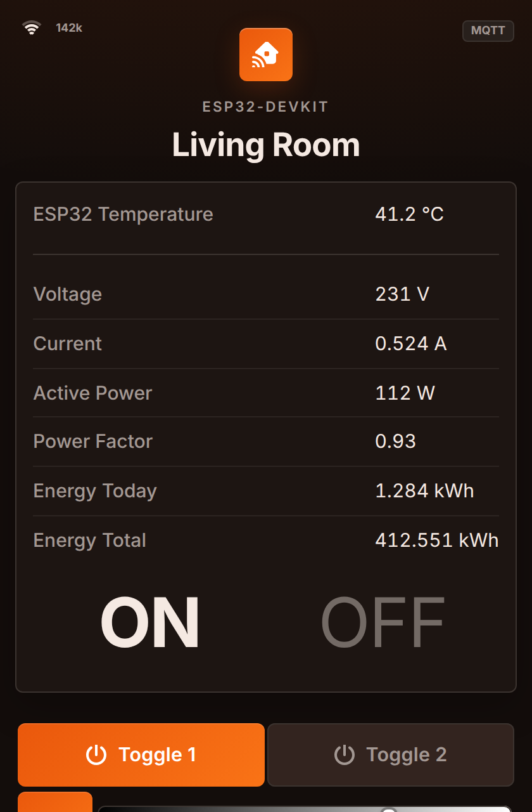
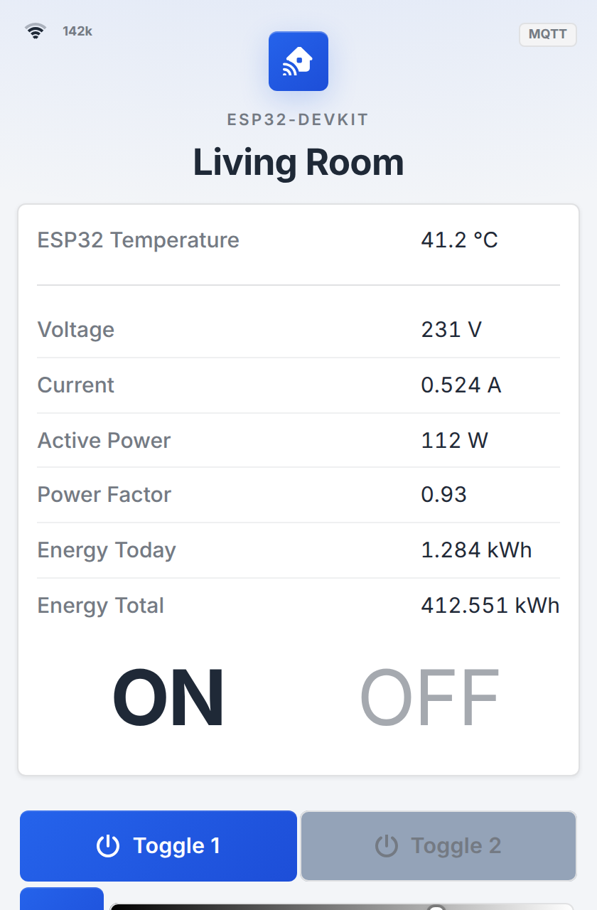
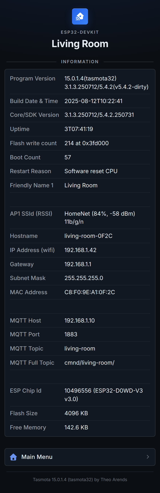
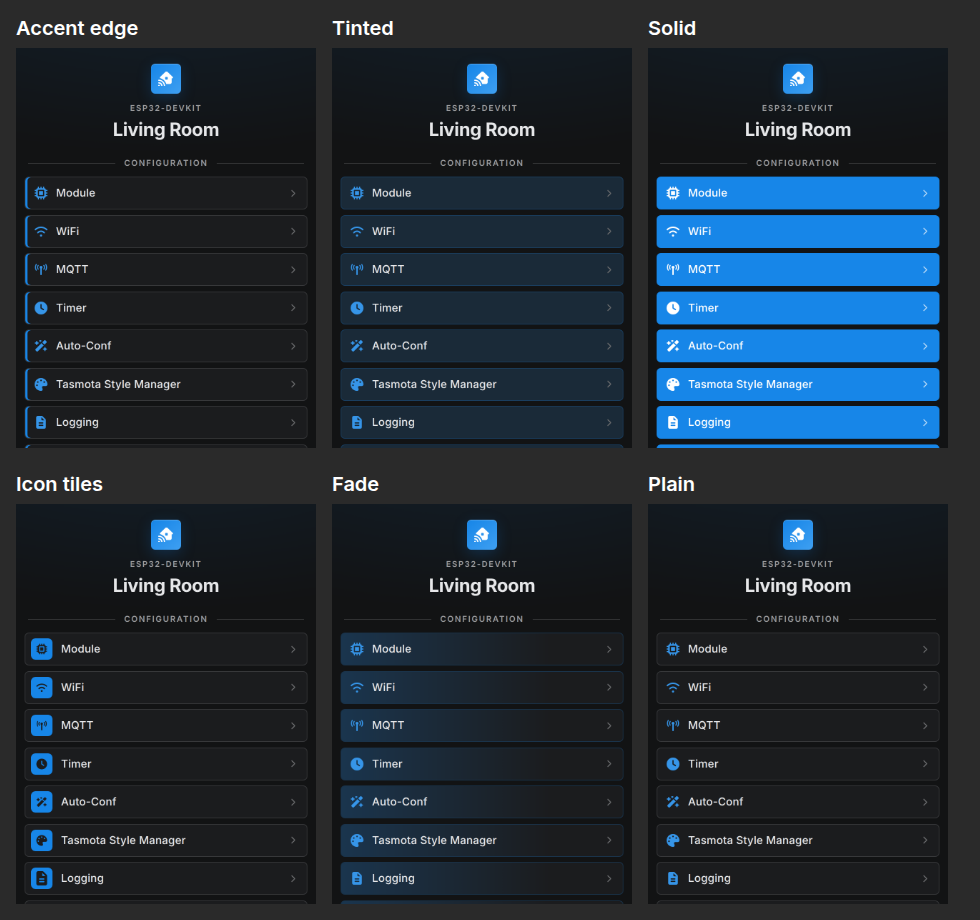
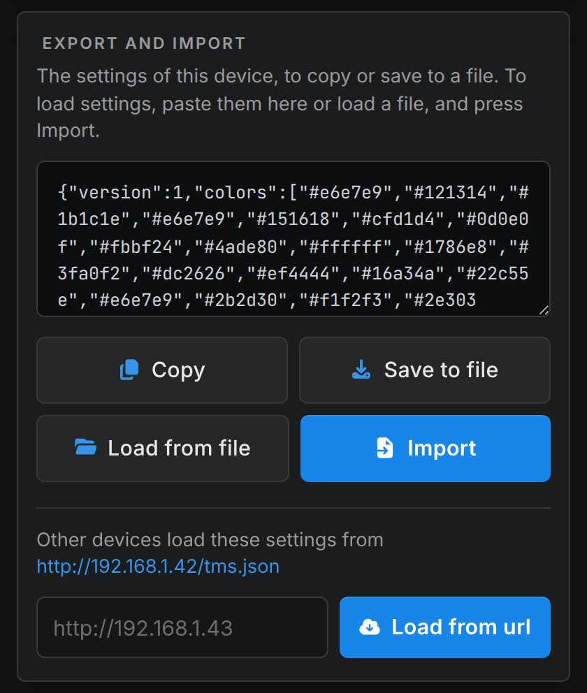

# Tasmota Style

A modern theme for the Tasmota web UI, installed as a Tasmota extension (`.tapp`). It restyles every page,
Tasmota's own and the ones added by Berry extensions, without changing the firmware. The colours are Tasmota's
own `WebColor` settings, picked from presets or one by one in the Tasmota Style Manager, and copied between
devices as JSON.

<table>
<tr><th>Tasmota</th><th>Tasmota Style</th><th>Tasmota Style Manager</th></tr>
<tr>
<td valign="top"></td>
<td valign="top"></td>
<td valign="top"></td>
</tr>
</table>

<table>
<tr><th>Midnight</th><th>Graphite</th><th>Ocean</th><th>Ember</th><th>Daylight</th></tr>
<tr>
<td valign="top"></td>
<td valign="top"></td>
<td valign="top"></td>
<td valign="top"></td>
<td valign="top"></td>
</tr>
</table>

<table>
<tr><th>Configuration</th><th>Settings</th><th>Information</th><th>Console</th></tr>
<tr>
<td valign="top"></td>
<td valign="top"></td>
<td valign="top"></td>
<td valign="top"></td>
</tr>
</table>

- Pages are a single centred column. The sensors, the information page and every form are cards.
- Menu buttons are rows with a [Font Awesome](https://fontawesome.com) icon and a chevron, Restart and Reset are red.
- The power buttons are coloured when the relay is on and grey when it is off.
- The light sliders have fader handles over Tasmota's colour gradients.
- Inputs have a focus ring, the console and the script editors are monospaced and wider.
- The only movement is a short colour fade on hover and focus. Nothing in the sensor area, which Tasmota
  redraws every couple of seconds, is animated.

## Install

To install this extension in Tasmota, paste the url 

```
https://raw.githubusercontent.com/rmawatson/tasmota-style/refs/heads/main/extensions/
```

into the field at the bottom of the Online Store in `Tools->Extension Manager`, press Enter, and install Tasmota Style
from the list.

Or download 


[tasmota_style.tapp](https://raw.githubusercontent.com/rmawatson/tasmota-style/refs/heads/main/extensions/tapp/tasmota_style.tapp)


and upload it to the `/.extensions` folder of the device with Tools > Manage File system. Start it from
Tools > Extension Manager, or restart the device.

Or in the Berry Scripting console:

```berry
import path
path.mkdir("/.extensions")
tasmota.urlfetch("https://raw.githubusercontent.com/rmawatson/tasmota-style/refs/heads/main/extensions/tapp/tasmota_style.tapp", "/.extensions/tasmota_style.tapp")
tasmota.load("/.extensions/tasmota_style.tapp")
```

Reload the page to see the theme. To go back to Tasmota's own style, press Running (which stops it) or
Uninstall in the Extension Manager.

## Colours

The theme uses the 20 colours of Tasmota's `WebColor` command. The first time it starts it sets them to the
Charcoal preset. The colours you had are kept, and put back when the extension stops or is uninstalled. The
theme's colours are kept too, and set again when it starts.

Change them in Configuration > Tasmota Style Manager:

- **Presets** sets all 20 colours at once: Charcoal, Midnight, Graphite, Ocean, Ember, Daylight, and Tasmota's own
  Tasmota dark and Tasmota light. If the colours you had before were not one of them, they are there as
  Before Tasmota Style. The preset in use is marked Current.
- **Menu buttons** sets the style of the menu rows (Configuration, Information, ...): Accent edge, Tinted,
  Solid, Icon tiles, Fade or Plain. Each takes its colours from the button colours, and Restart and Reset from
  the reset button colours. The style is kept in `persist` as `tms_buttons`.
- **Colours** shows the 20 colours with a colour picker each, Save sets them.
- **Export and import** copies the colours and menu buttons to another device, see
  [Export and import](#export-and-import).
- **Reset to defaults** sets the colours and menu buttons the theme starts with, the Charcoal preset and Accent
  edge, after asking to confirm.
  Tasmota's own default colours are the Tasmota dark preset.



The `WebColor` command works too, `WebColor11 #1786e8` sets the button colour, and
`WebColor {"WebColor":["#e6e7e9","#121314",...]}` all 20. The page shows the colours Tasmota has.

The stylesheet uses Tasmota's colours, and mixes the rest from them: the borders and rows of the cards from
the form and text colours, the dimmer text from the text colour, the icons and links from the button colour.
When the background is light, the browser's own controls (check boxes, drop downs, scroll bars) are light too.

The same settings can be changed with the [commands](#commands).

## Export and import

The settings are the 20 colours and the style of the menu buttons, as JSON:

```json
{"version":1,"colors":["#e6e7e9","#121314","#1b1c1e",...],"buttons":"edge"}
```

The Export and import card of the Tasmota Style Manager shows the settings of the device in a box.

- **Copy** copies the text in the box, to paste on another device.
- **Save to file** saves it as `tasmota_style.json`.
- **Load from file** puts a file in the box, and so does pasting settings into it. **Import** sets them.
- **Load from url** loads the settings of another device. The card shows the url other devices load this one's
  from, `http://192.168.1.42/tms.json`. An address on its own, `192.168.1.43` or `http://192.168.1.43`, gets
  `http://` and `/tms.json` added. Any other url is loaded as it is, so a file on a web server works too,
  `https://example.com/my_style.json`.



Everything is checked before anything is set. The settings can have `colors` or `buttons` on their own, to
set only those. When they can not be imported the message says why, and the text or url is kept to correct it.

`/tms.json` can be read without the web password, so a device with one can be copied too. It has the colours and
the menu button style, nothing else. A device can not load its own url, its web server answers one request at a
time.

## Commands

Commands are either read only (ro), read write (rw) or write only (wo). Arguments can be given

- in order, `TsmConfig Midnight,tinted`
- as key=value pairs, `TsmConfig buttons=Icon tiles`. A value can contain spaces, but not `,`
- as JSON, `TsmConfig {"preset":"Tasmota dark"}`

The names of presets and menu button styles can be given in any case, with or without spaces, `tasmotadark` is
Tasmota dark, and a menu button style by its id or its name, `tiles` or `Icon tiles`. An error is logged, such as
`TMS: TsmConfig error: there is no preset 'Nope', TsmPresets lists them`, and answered with `{"TsmConfig":"Error"}`.

> ### TsmConfig (rw)
>
> Shows the preset of the colours and the menu button style with no arguments,
> `{"TsmConfig":{"preset":"Charcoal","buttons":"edge"}}`, or sets them, `TsmConfig preset=Midnight,buttons=tinted`,
> and answers with the result. The preset is `null` when the colours are not one of them.
>
> `preset`<br/>
> Sets the 20 colours, from one of the presets `TsmPresets` lists
>
> `buttons`<br/>
> The style of the menu buttons, `edge` (Accent edge), `tinted`, `solid`, `tiles` (Icon tiles), `fade` or
> `plain` `default=edge`

> ### TsmPresets (ro)
>
> Lists the presets and the menu button styles,
> `{"TsmPresets":{"presets":["Charcoal","Midnight",...,"Tasmota light"],"buttons":["edge","tinted",...,"plain"]}}`.
> Before Tasmota Style is listed too when the colours from before the theme are not a preset

> ### TsmResetConfig (wo)
>
> Sets the colours and menu buttons the theme starts with, the Charcoal preset and Accent edge, like Reset to defaults

> ### TsmExport (ro)
>
> Answers the settings as JSON, the same as `/tms.json`,
> `{"TsmExport":{"version":1,"colors":["#e6e7e9","#121314",...],"buttons":"edge"}}`

> ### TsmImport (wo)
>
> Sets the settings from JSON, `TsmImport {"version":1,"colors":[...],"buttons":"edge"}` or
> `TsmImport {"buttons":"tinted"}`, or loads them from another device like Load from url, `TsmImport 192.168.1.43`

## How it works

Tasmota has no setting for a stylesheet, but it writes the `WebCanvas` setting (the page background) unescaped
into the style in the head of every page:

```
body{background:<WebCanvas> 0 0 / cover no-repeat fixed;}
```

When the extension starts it sets `WebCanvas` to

```
var(--c_bg)}</style><link rel=stylesheet href=/tms.css><style>:root{--tms:1
```

which ends that rule and the style, links `/tms.css`, and opens a style that takes the rest of the line. The
extension adds the `/tms.css` page, which sends the stylesheet from the tapp, as well as `/tms` for the Tasmota
Style Manager and `/tms.json` for the settings. A `WebCanvas` you had set is kept in front of the link, and put
back when the extension stops or is uninstalled.

Tasmota's pages use the same markup in every language, so the stylesheet matches them on their form actions
(`cn` for Configuration, `md` for Module, ...) and on the inline styles Tasmota writes. The colours come from
the `--c_bg`, `--c_btn`, ... variables Tasmota writes with the `WebColor` colours in every page.

## Notes

- The stylesheet is about 46 KB, 27 KB of it icons. Tasmota sends every page an extension adds with
  `Cache-Control: no-cache, no-store, must-revalidate`, so the browser loads it again with every page.
- `WebCanvas` shares Tasmota's 699 character settings text area with the other text settings. The theme needs
  75 characters, or 92 plus the length of your own `WebCanvas` if you set one. When it does not fit, the log
  shows `TMS: unable to set WebCanvas, the settings have no room for it. The theme is not shown`.
- Setting `WebCanvas` while the theme runs removes the theme until the extension starts again. It then keeps
  your new value in front of the link, to put back when it stops. The theme draws its own background over it.
- The colours from before the theme are kept in `persist` as `tms_colors_before`, and the theme's colours as
  `tms_colors` while it is stopped.
- When Tasmota can not write `persist` to `_persist.json`, most often because the file system is full, the
  Tasmota Style Manager shows `Unable to save the settings, write failed`. Tasmota's `persist.save()` then writes
  `{}` to the file, and the values of every extension are only in memory. Free some space, and run
  `persist.save(true)` in the Berry Scripting console before restarting.
- If the tapp is deleted from the file system without stopping it first, the link stays in `WebCanvas` and
  the theme's colours stay set. The stylesheet is then not found, and the pages are Tasmota's own with those
  colours. `WebCanvas 0` removes the link, `WebColor 0` sets Tasmota's default colours.
- The theme uses Inter if it is installed, otherwise the system font (Segoe UI, San Francisco, Roboto).
- The mixed colours need `color-mix()` (Chrome and Edge 111, Safari 16.2, Firefox 113 and later), the cards
  around the sensors and the wider console need `:has()`. Icons need CSS masks.
- Menu buttons added by other extensions get a cube icon. To give one its own icon, add a rule like
  `form[action=myext] { --i: icon(puzzle-piece) }` to `src/tms.css`, with the icon in `src/icons`.

## Building

```
python3 scripts/gen_css.py   # builds raw/tasmota_style/tms.css from src/tms.css and src/icons
python3 scripts/gen.py       # builds extensions/tapp/tasmota_style.tapp and extensions/extensions.jsonl
```

`src/tms.css` is the stylesheet, `icon(name)` in it is replaced by `src/icons/name.svg`. Each menu button style in
`src/buttons` is built to its own file in the tapp, the extension adds the chosen one to the end of the stylesheet.
The icons are copied
from the `svgs` folder of Font Awesome Free 7.3.1. `scripts/upload.py` uploads a tapp to a device over FTP.

## Credits

Icons: [Font Awesome Free](https://fontawesome.com) 7.3.1 by @fontawesome, licensed under
[CC BY 4.0](https://creativecommons.org/licenses/by/4.0/) (https://fontawesome.com/license/free).

The theme is MIT licensed, see [LICENSE](LICENSE).
